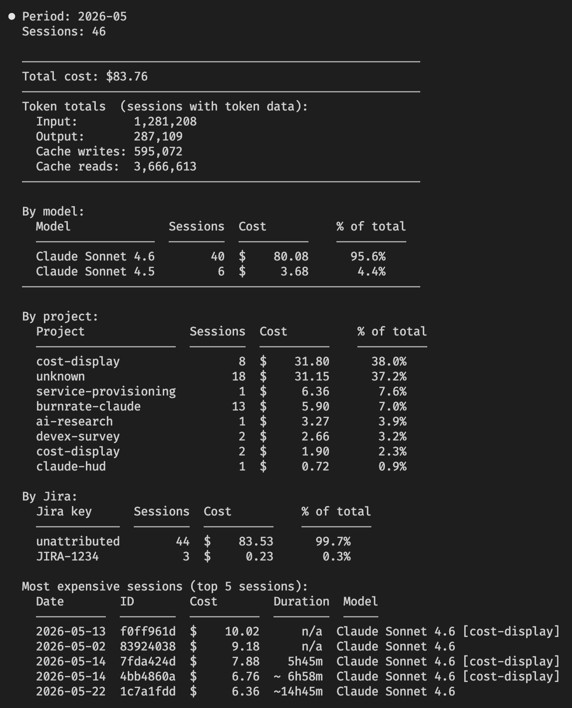
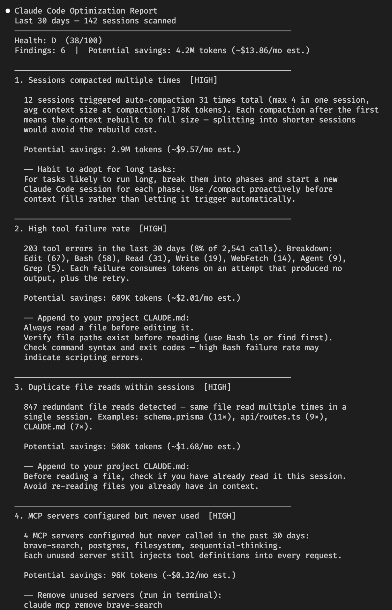

# Burnrate

Real-time cost and context display for GitHub Copilot CLI. Shows per-session token spend, month-to-date total, context window usage, model, and git branch; directly in the statusline, updated every turn.


Layout is fully configurable. See [`/burnrate:configure`](#skills).

---

## Why

GitHub Copilot CLI doesn't show you what you're spending. It tracks your quota and rate limits, but there's no running cost total, no month-to-date figure, and no way to see whether a long session is burning through your budget. This plugin adds all of that — directly in the footer, updated on every turn, stored locally with no external calls.

The goal is behavioral: when cost is visible in real time, you make different decisions. You compact earlier. You switch to a cheaper model for simple tasks. You notice when a session has gone off the rails. The MTD + projected monthly figure creates budget awareness that's impossible without it.

---

## Installation

See [`docs/quick-start.md`](docs/quick-start.md) for full installation details, requirements, and configuration.

---

## Features:

### 1. Real-time Cost Awareness

Token consumption and cost, MTD and projected month total, context window usage, model, Jira, and git branch; directly in the statusline, updated every turn. 

### 2. Context Window Warnings

LLMs are less effective when the context window becomes saturated. Warn user when context window gets into the “dumb zone”. 

### 3. Structured Spend Report

Produces a structured spend report. Useful for accountability; answering "where did my budget actually go this month" and attributing AI spend to specific projects or work items.

Shows:

- **MTD Cost** (or a date range you specify)
- **Token Breakdown** — input, output, cache writes, cache reads across all sessions
- **By-Model Breakdown** — session count and cost per model, so you can see if an expensive model is being used for bulk work
- **Top Expensive Sessions** — the 5 costliest sessions with date, turn count, and model
- **By-project and by-Jira breakdown** — when branches follow ticket naming conventions, cost is attributed per project or per ticket



## 4. Anti-Pattern Correction (/optimize)

Runs analysis over the last 30 days (configurable with --days) and produces a scored health report (0–100). Useful for anti-pattern correction; answering "how could I be using this tool more efficiently" and surfacing habits that silently inflate costs.

Shows:

- **Health score** — a single number summarizing usage efficiency
- **Model mix** — what fraction of spend is on which model
- **Tool usage frequency** — which tools are called most, useful for spotting expensive patterns (e.g., excessive web_fetch or long-running bash chains)
- **Session stats** — average turns per session, p95 outliers
- **Recommendations** — prioritized, actionable suggestions (e.g., "3 sessions exceeded 50 turns — consider compacting earlier")



## Next Steps & Features

- Built-in Model Routing - automatically choose right-size model for task
- Model or Tool Blocking - prevent users from using models or tools
- Mechanism for distributing SDLC workflows/functionality to teams
  - Update plugin to receive new features
  - Codify team workflow patterns as skills/commands (Jira, Confluence, Git, Plans, Tests, Docs)
- Use Hooks to enable safety checks (configure per team)
  - Eg. Check git diff for API tokens or passwords before commit  
- Push AI Cost/Token data to Jira field per task
- Push developer telemetry to our cloud for reporting
  - Aggregate reporting on developer usage (model, context, work item, etc)
  - Identify SDLC trends & opportunities for improvement

## How it works

Copilot CLI does not provide a pre-computed USD cost in its statusline payload — unlike Claude Code, which exposes `cost.total_cost_usd` directly. Instead, Copilot exposes a full token breakdown:

```json
{
  "context_window": {
    "total_input_tokens": 24100,
    "total_output_tokens": 8420,
    "total_cache_read_tokens": 5200,
    "total_cache_write_tokens": 1100
  }
}
```

This plugin computes cost from these four token types using a local pricing table (`pricing.json`) sourced from [GitHub's official billing docs](https://docs.github.com/en/copilot/reference/copilot-billing/models-and-pricing). This is actually more transparent than the Claude approach — every token type and its cost is visible.

---

## Architecture

1. **SessionStart hook** — writes a session file capturing model, project, git branch, and a zero-baseline token snapshot
2. **statusLine command** — on every turn, computes cost from (current tokens − baseline), writes `last_known_cost` and `last_known_tokens` back to the session file, renders the display
3. **SessionEnd hook** — reads `last_known_tokens`, computes final cost, appends a record to `~/.copilot/burnrate-copilot/monthly/YYYY-MM.jsonl`, deletes the session file
4. **Orphan recovery** — on next SessionStart, scans for session files left behind by Ctrl+C exits or crashes; recovers cost from `last_known_tokens` and archives them to the JSONL

All data is local. Plugin data folder structure:

```
~/.copilot/burnrate-copilot/
  pricing.json              ← model pricing table
  config.json               ← widget layout and theme
  sessions/<id>.json        ← per-session state (deleted at clean exit)
  monthly/YYYY-MM.jsonl     ← completed session records
```

---

## Contributing

The plugin is written in plain Node.js with no runtime dependencies. Key files:

| File | Role |
|---|---|
| `scripts/statusline.js` | Entry point — reads stdin, calls compositor, writes stdout |
| `scripts/compositor.js` | Loads session data, computes cost delta, assembles widget data |
| `scripts/session-start.js` | SessionStart hook + orphan recovery |
| `scripts/session-end.js` | SessionEnd hook — final cost computation + JSONL append |
| `scripts/pricing.js` | `loadPricing`, `computeSessionCost`, `getMtdAndProjected` |
| `scripts/widgets/` | Individual display widgets (cost, context, git, session, jira, tools) |
| `pricing.json` | Model rates — update with `node scripts/update-pricing.js --apply` |
| `tests/` | Test suite — run with `node tests/<file>.test.js` |

To test locally, set `COPILOT_CONFIG_DIR` to a temp directory so test data doesn't touch your real session history.
