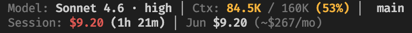

# Burnrate

Real-time cost and context display for GitHub Copilot CLI. Shows per-session token spend, month-to-date total, context window usage, model, and git branch — directly in the Copilot CLI statusline, updated every turn.



---

## Why

GitHub Copilot CLI doesn't show you what you're spending. It tracks your quota and rate limits, but there's no running cost total, no month-to-date figure, and no way to see whether a long session is burning through your budget. This plugin adds all of that — directly in the footer, updated on every turn, stored locally with no external calls.

The goal is behavioral: when cost is visible in real time, you make different decisions. You compact earlier. You switch to a cheaper model for simple tasks. You notice when a session has gone off the rails. The MTD + projected monthly figure creates budget awareness that's impossible without it.

---

## What you see

```
$0.08 session  |  May: $6.21 (~$41/mo)  |  claude-sonnet-4.6  |  28%  |  8m  |  main ✎
```

| Segment | What it shows |
|---|---|
| `$0.08 session` | Cost for the current session (computed from token deltas) |
| `May: $6.21 (~$41/mo)` | Month-to-date total + linear projection |
| `claude-sonnet-4.6` | Active model |
| `28%` | Context window utilization |
| `8m` | Session elapsed time |
| `main ✎` | Git branch + uncommitted changes indicator |

Layout is fully configurable. See [`/burnrate:configure`](#skills).

---

## Installation

In the Copilot CLI chat:

```
/plugin install git@github.com:upld-internal/burnrate-copilot.git
```

SSH is required (HTTPS is blocked by SAML SSO on the `upld-internal` org). The plugin auto-configures the statusline on first session start — no manual config edits needed.

See [`docs/quick-start.md`](docs/quick-start.md) for full installation details, requirements, and troubleshooting.

---

## Skills

| Skill | Invocation | What it does |
|---|---|---|
| Cost summary | `/burnrate:burnrate-cost-summary` | Monthly spend by project, model, and Jira ticket |
| Optimize | `/burnrate:burnrate-optimize` | Scored health report with actionable cost-reduction recommendations |
| Report | `/burnrate:burnrate-report` | Packages session data into a zip for bug reports |
| Configure | `/burnrate:configure` | Interactive statusline layout configurator |
| Setup | `/burnrate:setup` | Manually (re-)configure the statusline pointer |

---

## How it works

Copilot CLI does not provide a pre-computed USD cost in its statusline payload — unlike Claude Code, which exposes `cost.total_cost_usd` directly. Instead, Copilot exposes a full token breakdown:

```json
{
  "context_window": {
    "total_input_tokens": 24100,
    "total_output_tokens": 8420,
    "total_cache_read_tokens": 5200,
    "total_cache_write_tokens": 1100
  }
}
```

This plugin computes cost from these four token types using a local pricing table (`pricing.json`) sourced from [GitHub's official billing docs](https://docs.github.com/en/copilot/reference/copilot-billing/models-and-pricing). This is actually more transparent than the Claude approach — every token type and its cost is visible.

---

## Architecture

1. **SessionStart hook** — writes a session file capturing model, project, git branch, and a zero-baseline token snapshot
2. **statusLine command** — on every turn, computes cost from (current tokens − baseline), writes `last_known_cost` and `last_known_tokens` back to the session file, renders the display
3. **SessionEnd hook** — reads `last_known_tokens`, computes final cost, appends a record to `~/.copilot/burnrate-copilot/monthly/YYYY-MM.jsonl`, deletes the session file
4. **Orphan recovery** — on next SessionStart, scans for session files left behind by Ctrl+C exits or crashes; recovers cost from `last_known_tokens` and archives them to the JSONL

All data is local. No network calls. No telemetry.

```
~/.copilot/burnrate-copilot/
  pricing.json              ← model pricing table
  config.json               ← widget layout and theme
  sessions/<id>.json        ← per-session state (deleted at clean exit)
  monthly/YYYY-MM.jsonl     ← completed session records
```

---

## Relationship to burnrate-claude

`burnrate-copilot` and [`burnrate-claude`](../burnrate-claude/) are parallel implementations of the same concept for two different AI CLI tools:

| | burnrate-copilot | burnrate-claude |
|---|---|---|
| Platform | GitHub Copilot CLI | Claude Code CLI |
| Config | `~/.copilot/settings.json` | `~/.claude/settings.json` |
| Cost source | Computed from token breakdown × pricing table | Native `cost.total_cost_usd` from stdin |
| Pricing | GitHub AI Credits rates | Anthropic direct API rates |
| Data dir | `~/.copilot/burnrate-copilot/` | `~/.claude/burnrate-claude/` |
| Hooks | `sessionStart`, `userPromptSubmitted`, `preToolUse`, `postToolUse`, `sessionEnd` | `SessionStart`, `PostToolUse`, `SessionEnd` |

Both use the same JSONL schema for monthly records, enabling a future unified cross-tool cost summary.

---

## Contributing

The plugin is written in plain Node.js with no runtime dependencies. Key files:

| File | Role |
|---|---|
| `scripts/statusline.js` | Entry point — reads stdin, calls compositor, writes stdout |
| `scripts/compositor.js` | Loads session data, computes cost delta, assembles widget data |
| `scripts/session-start.js` | SessionStart hook + orphan recovery |
| `scripts/session-end.js` | SessionEnd hook — final cost computation + JSONL append |
| `scripts/pricing.js` | `loadPricing`, `computeSessionCost`, `getMtdAndProjected` |
| `scripts/widgets/` | Individual display widgets (cost, context, git, session, jira, tools) |
| `pricing.json` | Model rates — update with `node scripts/update-pricing.js --apply` |
| `tests/` | Test suite — run with `node tests/<file>.test.js` |

To test locally, set `COPILOT_CONFIG_DIR` to a temp directory so test data doesn't touch your real session history.
