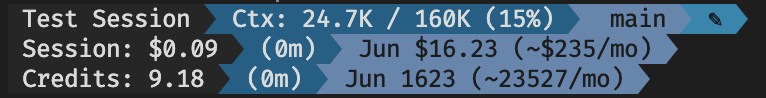

# Widget Configuration

burnrate-copilot's statusline is assembled from a list of widgets defined in your config file. You can rearrange them, tune each one's options, and choose between plain and Powerline-styled rendering.

---

## Config file location

```
~/.copilot/plugin-data/burnrate-copilot/config.json
```

The file is created automatically on first run. You can edit it directly with any text editor; changes take effect on the next Copilot CLI turn.

---

## Using the configure skill

For an interactive setup, run inside the Copilot CLI chat:

```
/burnrate:configure
```

The wizard lets you pick a preset or assemble a custom layout widget by widget, then writes the result to `config.json`. Presets available:

| Preset | Description |
|---|---|
| **Minimal** | Model, context %, duration — single line |
| **Standard** | Model, context, branch + cost, duration, MTD — two lines (default) |
| **Full** | Everything: tokens, speed, premium requests, tools, git |
| **Powerline** | Standard layout with Powerline styling + theme selection |
| **Custom** | Widget-by-widget interactive configuration |

---

## Config file schema

```json
{
  "powerline": false,
  "theme": "default",
  "separator": "│",
  "segments": [
    { "widget": "model_name", "short": true, "show_label": true },
    { "widget": "separator" },
    { "widget": "context_window", "format": "full", "show_label": true },
    { "widget": "separator" },
    { "widget": "git_branch" },
    { "widget": "git_status" },
    { "widget": "newline" },
    { "widget": "session_cost", "show_label": true },
    { "widget": "session_duration" },
    { "widget": "separator" },
    { "widget": "mtd_cost" }
  ],
  "jira": {
    "project_keys": ["PROJ", "ENG"],
    "base_url": "https://yourcompany.atlassian.net/browse"
  }
}
```

**Top-level keys:**

| Key | Type | Default | Description |
|---|---|---|---|
| `powerline` | boolean | `false` | Enable Powerline-styled rendering (requires Nerd Font) |
| `theme` | string | `"default"` | Color theme — see [Themes](#themes) below |
| `separator` | string | `"│"` | Separator character between widgets in plain mode |
| `segments` | array | Standard preset | Ordered list of widget definitions |
| `jira` | object | — | Optional Jira integration settings |

Each entry in `segments` is an object with a required `"widget"` key naming the widget, plus any widget-specific options.

---

## Widgets

### Cost widgets

#### `session_cost`

Current session cost in USD. Color-codes by cost: plain below $1, amber above $1, red above $5.

```json
{ "widget": "session_cost", "show_label": true }
```

| Option | Type | Default | Description |
|---|---|---|---|
| `show_label` | boolean | `true` | Prefix with `Session:` |

Example output: `Session: $4.23`

---

#### `mtd_cost`

Month-to-date cost across all completed sessions, with a linear projection to end of month.

```json
{ "widget": "mtd_cost", "show_projected": true }
```

| Option | Type | Default | Description |
|---|---|---|---|
| `show_projected` | boolean | `true` | Append `(~$X/mo)` projection |

Example output: `Jun $142.50 (~$285/mo)`

---

#### `session_credits`

Current session cost in AI Credits (1 credit = $0.01 USD). Matches the format shown in the Copilot footer. Color-codes: plain below 100 credits, amber above 100, red above 500.

```json
{ "widget": "session_credits", "show_label": true }
```

| Option | Type | Default | Description |
|---|---|---|---|
| `show_label` | boolean | `true` | Prefix with `Credits:` |

Example output: `Credits: 423.10`

---

#### `mtd_credits`

Month-to-date AI Credits used vs. your monthly entitlement, with a percentage and optional projection. The slash and entitlement are dim; the percentage is bold.

```json
{ "widget": "mtd_credits", "show_projected": true }
```

| Option | Type | Default | Description |
|---|---|---|---|
| `show_projected` | boolean | `true` | Append `(~X/mo)` projection |

Example output: `Jun 2757 / 3000 (92%) (~41349/mo)`

---

#### `quota_remaining`

AI credits remaining in your monthly quota, sourced from GitHub's billing API. Requires `gh` CLI to be installed and authenticated.

```json
{ "widget": "quota_remaining", "show_reset_date": true }
```

| Option | Type | Default | Description |
|---|---|---|---|
| `show_reset_date` | boolean | `true` | Append `· resets MMM D` |
| `show_label` | boolean | `false` | Prefix with a label |

Example output: `252 left · resets Jul 1`

A `~` prefix indicates the value is from a stale cache (more than 5 minutes old). Hidden when no quota data is available.

---

#### `quota_used`

AI credits used vs. your monthly entitlement, with a percentage.

```json
{ "widget": "quota_used" }
```

| Option | Type | Default | Description |
|---|---|---|---|
| `show_label` | boolean | `false` | Prefix with a label |

Example output: `2748/3000 (91.6%)`

Hidden when no quota data is available.

---

#### `overage_status`

Number of overage interactions this month. Only visible when `overage_count > 0`; returns nothing otherwise.

```json
{ "widget": "overage_status" }
```

| Option | Type | Default | Description |
|---|---|---|---|
| `show_label` | boolean | `false` | Prefix with a label |

Example output: `+3 overage`

---

### Context widgets

#### `context_window`

Context window utilization. Color-codes: plain below 50%, amber 50–70%, red above 70%.

```json
{ "widget": "context_window", "format": "full", "show_label": true }
```

| Option | Type | Default | Description |
|---|---|---|---|
| `format` | string | `"percent"` | `"percent"` · `"bar"` · `"tokens"` · `"full"` |
| `show_label` | boolean | `true` | Prefix with `Ctx:` |

Format examples:
- `percent` → `42%`
- `bar` → `████░░░░░░ 42%`
- `tokens` → `48.2K / 160K`
- `full` → `48.2K / 160K (42%)`

---

#### `premium_requests`

Number of premium API requests consumed this session. Hidden when count is zero unless `show_zero` is enabled.

```json
{ "widget": "premium_requests" }
```

| Option | Type | Default | Description |
|---|---|---|---|
| `show_label` | boolean | `false` | Prefix with `Prem:` |
| `show_zero` | boolean | `false` | Show even when count is 0 |

Example output: `⟐ 3`

---

#### `token_breakdown`

Compact cumulative token summary for the session.

```json
{ "widget": "token_breakdown", "show_cache": true }
```

| Option | Type | Default | Description |
|---|---|---|---|
| `show_label` | boolean | `false` | Prefix with `Tokens:` |
| `show_cache` | boolean | `true` | Include combined cache token count |

Example output: `in:24.1K out:8.4K cache:6.3K`

---

#### `output_speed`

Output token throughput, computed from total output tokens divided by total API duration.

```json
{ "widget": "output_speed" }
```

| Option | Type | Default | Description |
|---|---|---|---|
| `show_label` | boolean | `false` | Prefix with `Speed:` |

Example output: `42 t/s`

---

#### `last_call`

Token counts for the most recent API call only (not cumulative).

```json
{ "widget": "last_call" }
```

| Option | Type | Default | Description |
|---|---|---|---|
| `show_label` | boolean | `false` | Prefix with `Last:` |

Example output: `↳ 3.2K / 820`

---

#### `cache_breakdown`

Separate read and write cache token counts for the session.

```json
{ "widget": "cache_breakdown" }
```

| Option | Type | Default | Description |
|---|---|---|---|
| `show_label` | boolean | `false` | Prefix with `Cache:` |

Example output: `R:5.2K W:1.1K`

---

### Session widgets

#### `model_name`

Active model with optional effort/multiplier badge, parsed from Copilot's display name.

```json
{ "widget": "model_name", "short": true, "show_badge": true }
```

| Option | Type | Default | Description |
|---|---|---|---|
| `short` | boolean | `true` | Abbreviate — strip `claude-` prefix, capitalise family |
| `show_badge` | boolean | `true` | Append effort/multiplier if present (e.g. `3x (high)`) |
| `show_label` | boolean | `false` | Prefix with `Model:` |

Example output: `Sonnet 4.6 3x (high)` or `Opus 4.7`

---

#### `session_duration`

Elapsed time since session start.

```json
{ "widget": "session_duration" }
```

| Option | Type | Default | Description |
|---|---|---|---|
| `show_label` | boolean | `false` | Prefix with `Dur:` |

Example output: `(47m)` or `(2h 3m)`

---

#### `session_name`

The session's name, when one has been set. Hidden if the field is absent or empty.

```json
{ "widget": "session_name" }
```

| Option | Type | Default | Description |
|---|---|---|---|
| `show_label` | boolean | `false` | Prefix with `Session:` |

Example output: `feature-auth`

---

#### `lines_changed`

Cumulative lines added and removed in the session, sourced from Copilot's cost data.

```json
{ "widget": "lines_changed" }
```

| Option | Type | Default | Description |
|---|---|---|---|
| `show_label` | boolean | `false` | Prefix with `Lines:` |

Example output: `+42/-3`

---

### Git widgets

#### `git_branch`

Current branch name with optional ahead/behind commit counts.

```json
{ "widget": "git_branch", "show_ahead_behind": true }
```

| Option | Type | Default | Description |
|---|---|---|---|
| `show_ahead_behind` | boolean | `true` | Append `↑N ↓N` when the branch diverges from upstream |

Example output: `main ↑2 ↓1`

---

#### `git_status`

Dirty indicator — shows `✎` when there are uncommitted changes. Returns nothing when the working tree is clean.

```json
{ "widget": "git_status" }
```

No options. Typically placed directly after `git_branch`.

---

### Jira widget

#### `jira_ticket`

Active Jira ticket detected from the current branch name (e.g. `feature/PROJ-123-my-task`). Renders as a clickable OSC 8 hyperlink in terminals that support it.

```json
{ "widget": "jira_ticket", "show_source": false, "link": true }
```

| Option | Type | Default | Description |
|---|---|---|---|
| `show_source` | boolean | `false` | Append a source icon indicating how the ticket was detected |
| `show_label` | boolean | `false` | Prefix with a label |
| `color` | string | — | Override text color (`red`, `green`, `yellow`, `blue`, `magenta`, `cyan`, `white`) |
| `link` | boolean | `true` | Render as a clickable hyperlink |
| `base_url` | string | — | Override the Atlassian base URL for this widget only |

Source icons: `●` explicit · `⎇` branch · `↩` commit · `⬡` Atlassian MCP

To configure the Jira integration globally, add a `jira` section to the top level of `config.json`:

```json
{
  "jira": {
    "project_keys": ["PROJ", "ENG", "INFRA"],
    "base_url": "https://yourcompany.atlassian.net/browse"
  }
}
```

`project_keys` restricts ticket detection to those prefixes. Without it, any `[A-Z]+-\d+` pattern in the branch name is treated as a Jira key.

---

### Tool tracking widgets

#### `tool_activity`

Recent tool calls with status icons and tool-type icons.

```json
{ "widget": "tool_activity", "max_tools": 4 }
```

| Option | Type | Default | Description |
|---|---|---|---|
| `max_tools` | number | `4` | Maximum number of recent tools to show |
| `show_label` | boolean | `false` | Prefix with a label |

Status icons: `✓` success · `✗` failure · `◐` running · `⊘` denied

Tool icons: `⌨` Bash · `✎` Edit · `◉` View/Read · `✚` Write · `⊛` Glob/Grep · `⟳` Task

Example output: `✓ ⌨ Bash: ls ×3  ◐ ✎ Edit: auth.js`

---

#### `agent_activity`

Spawned sub-agents with their status and elapsed time.

```json
{ "widget": "agent_activity", "max_agents": 3 }
```

| Option | Type | Default | Description |
|---|---|---|---|
| `max_agents` | number | `3` | Maximum number of agents to show |

Example output: `◐ [explore] Analyzing codebase (12s…)`

---

### System widget

#### `cwd`

Current working directory, showing the last N path segments.

```json
{ "widget": "cwd", "depth": 1 }
```

| Option | Type | Default | Description |
|---|---|---|---|
| `depth` | number | `1` | Number of trailing path segments to show |
| `show_label` | boolean | `false` | Prefix with a label |

Example output with `depth: 2`: `burnrate/burnrate-copilot`

---

### Custom widgets

#### `custom_text`

A static text label.

```json
{ "widget": "custom_text", "text": "🔥", "color": "red", "bold": false }
```

| Option | Type | Required | Description |
|---|---|---|---|
| `text` | string | yes | Text to display |
| `color` | string | — | `red` · `green` · `yellow` · `blue` · `magenta` · `cyan` · `white` · `dim` · `bold` |
| `bold` | boolean | — | Render bold |

---

#### `custom_symbol`

A single Unicode character or emoji.

```json
{ "widget": "custom_symbol", "symbol": "⚡", "color": "yellow" }
```

| Option | Type | Required | Description |
|---|---|---|---|
| `symbol` | string | yes | Character or emoji to display |
| `color` | string | — | Same color values as `custom_text` |

---

#### `custom_command`

Output of an arbitrary shell command. The full Copilot stdin JSON is piped to the subprocess.

```json
{ "widget": "custom_command", "command": "node ~/scripts/my-widget.js", "timeout": 1000 }
```

| Option | Type | Required | Description |
|---|---|---|---|
| `command` | string | yes | Shell command to run |
| `timeout` | number | — | Milliseconds before the command is killed (default `1000`) |
| `preserveColors` | boolean | — | Pass through ANSI codes from the command's output (default `false`) |

---

### Layout widgets

#### `separator`

A visual divider between segments. In Powerline mode, separators are suppressed and replaced by the arrow glyphs.

```json
{ "widget": "separator" }
```

| Option | Type | Default | Description |
|---|---|---|---|
| `char` | string | `"│"` | Override the separator character for this instance |

The global default separator can be set at the top level of `config.json` via the `"separator"` key.

---

#### `newline`

Starts a new line. Use it to build multi-row layouts.

```json
{ "widget": "newline" }
```

No options.

---

## Powerline mode

Set `"powerline": true` to enable Powerline-styled rendering. Each segment gets a cycling background color and segments are joined by filled arrow glyphs (``) instead of a separator character.



**Requirements:** a terminal font with Nerd Font glyphs or a Powerline-patched font. Popular choices include [Nerd Fonts](https://www.nerdfonts.com/), FiraCode Nerd Font, or MesloLGS NF (used by powerlevel10k).

In Powerline mode:
- `separator` widgets are automatically hidden.
- `newline` starts a new row.
- Segment background colors are taken from the active theme's `segmentColors` array and cycled per segment.

To enable Powerline mode with a theme:

```json
{
  "powerline": true,
  "theme": "nord"
}
```

---

## Themes

Themes control segment background colors in Powerline mode. In plain (non-Powerline) mode, themes have no effect — widgets use their own ANSI color coding.

| Theme | Description |
|---|---|
| `default` | Gray gradient — works in any terminal (ANSI-256: 237 → 239 → 241 → 243) |
| `minimal` | No background colors; plain text with spaces. Works without a Nerd Font. |
| `nord` | Arctic blues and teals (Nord palette) |
| `dracula` | Dark purples and pinks (Dracula palette) |
| `catppuccin` | Warm Mocha tones (Catppuccin palette) |

Set the theme in `config.json`:

```json
{ "theme": "dracula" }
```

The `minimal` theme suppresses all Powerline glyphs and background colors, making it suitable for terminals that don't support 256-color or Nerd Fonts even when `powerline` is `true`.

---

## Example configs

### Minimal (single line)

```json
{
  "powerline": false,
  "theme": "default",
  "segments": [
    { "widget": "model_name" },
    { "widget": "separator" },
    { "widget": "context_window" },
    { "widget": "separator" },
    { "widget": "session_cost" },
    { "widget": "separator" },
    { "widget": "session_duration" }
  ]
}
```

Output: `Sonnet 4.6 │ 42% │ $4.23 │ (47m)`

---

### Standard (default — two lines)

```json
{
  "powerline": false,
  "theme": "default",
  "segments": [
    { "widget": "model_name", "short": true, "show_label": true },
    { "widget": "separator" },
    { "widget": "context_window", "format": "full", "show_label": true },
    { "widget": "separator" },
    { "widget": "git_branch" },
    { "widget": "git_status" },
    { "widget": "newline" },
    { "widget": "session_cost", "show_label": true },
    { "widget": "session_duration" },
    { "widget": "separator" },
    { "widget": "mtd_cost" }
  ]
}
```

Output:
```
Model: Sonnet 4.6 │ Ctx: 48.2K / 160K (42%) │ main ✎
Session: $4.23 (47m) │ Jun $142.50 (~$285/mo)
```

---

### Powerline with Nord theme

```json
{
  "powerline": true,
  "theme": "nord",
  "segments": [
    { "widget": "model_name", "show_label": true },
    { "widget": "context_window", "format": "full", "show_label": true },
    { "widget": "git_branch" },
    { "widget": "git_status" },
    { "widget": "newline" },
    { "widget": "session_cost", "show_label": true },
    { "widget": "session_duration" },
    { "widget": "mtd_cost" }
  ]
}
```

---

### With Jira ticket and tool tracking

```json
{
  "powerline": false,
  "separator": " · ",
  "segments": [
    { "widget": "model_name" },
    { "widget": "separator" },
    { "widget": "context_window", "format": "percent" },
    { "widget": "separator" },
    { "widget": "jira_ticket", "show_source": true },
    { "widget": "separator" },
    { "widget": "session_cost" },
    { "widget": "separator" },
    { "widget": "tool_activity", "max_tools": 3 },
    { "widget": "separator" },
    { "widget": "session_duration" }
  ],
  "jira": {
    "project_keys": ["PROJ", "ENG"],
    "base_url": "https://yourcompany.atlassian.net/browse"
  }
}
```
